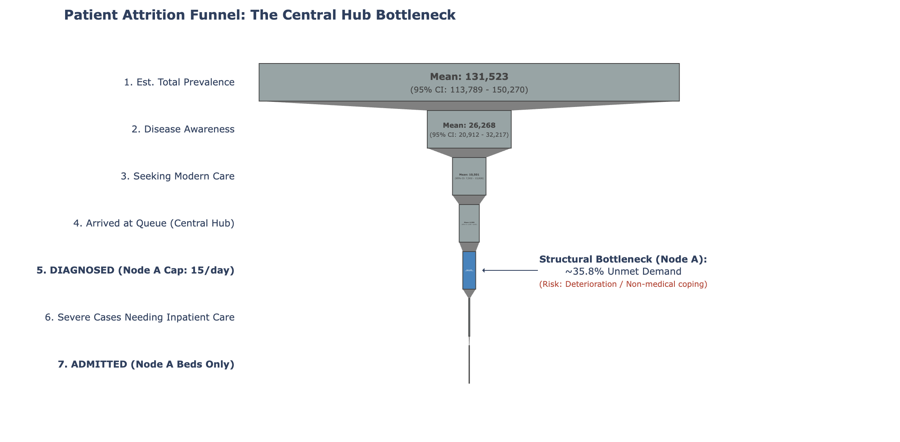
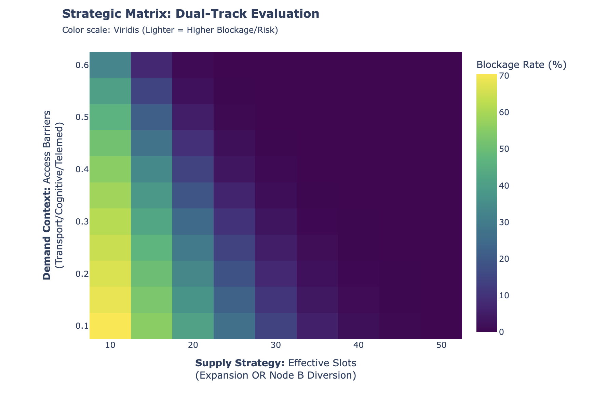

# Stochastic Modeling of Service Capacity for Depressive Disorders in Tibet

> ⚠️ **Note on Visualizations:** This notebook utilizes **Plotly** for interactive charts. Since GitHub does not render interactive scripts, **static screenshots** of the key results are embedded below for immediate viewing.

##  Project Background & Motivation
**From Clinical Observation to Quantitative Modeling**

During my experience accompanying patients to clinical visits, I observed a structural mismatch in healthcare resources for **depressive disorders** within hospitals in Tibet.

This project is my attempt to quantify these observations. Using a **Stochastic Discrete-Event Simulation**, I modeled the patient journey to identify bottlenecks that traditional qualitative surveys might miss.

##  Author's Contribution & Workflow
As a prospective student transitioning from medicine to data science, this project reflects my current learning process:

* **Concept & Logic (My Core Contribution):**
    * Designed the "Dual-Node" structure based on local hospital interactions.
    * **Data Curation:** All simulation parameters (prevalence rates, service capacity, patient behavior) were manually researched and calibrated based on the *7th National Population Census*, *Lancet Psychiatry* papers, and my own clinical fieldwork notes.

* **Implementation (AI-Assisted):**
    * I utilized AI coding assistants to help translate my logical flow charts into executable `Python` code (`NumPy`, `Pandas`).
    * While this workflow bridged my immediate gap in syntax, it also exposed my limitations in engineering robust code, reinforcing my determination to pursue systematic, in-depth learning in this field.

##  Key Findings & Visualizations

### 1. The Patient Attrition Funnel
This chart quantifies the bottleneck. Notice the **sharp decline** at the "Diagnosed" stage, visualizing the severe unmet demand due to the 15-slot capacity limit.

### 2. Strategic Heatmap (Supply vs. Demand)
The **"Stable Zone"** is only achievable when supply strategy shifts from "Hub Expansion" to "Diversion" (utilizing Node B), preventing the **"System Crash"** seen in the top-left quadrant where high barriers meet low capacity.

* **The "Awareness Paradox":** Increasing public awareness without expanding the central hub's capacity leads to a system crash (>70% blockage), not better care.
* **Solution:** A diversion strategy utilizing general hospitals is statistically more effective than expanding the specialist center alone.

##  Data Sources & Model Settings
All parameters are grounded in real-world evidence collected during my research:
* **Epidemiology:** *Huang et al. (2019)*; *7th National Population Census*.
* **Resource Mismatch (The Core Conflict):**
    * **Node A (Specialist Hub):** Constrained at **15 new-patient slots/day** over **270 effective working days/year**.
    * **Inpatient Capacity:** While Node A has 35 beds, the model accounts for **80% baseline occupancy** by other severe psychiatric disorders, leaving **<10 effective beds** for depression admissions.
    * **Node B (General Hospital):** High spare capacity with **~40 slots/day**, yet observed utilization was **<25%** during fieldwork at *Lhasa People's Hospital*.

##  Limitations
The current model represents a **static snapshot** of annual capacity. It does not yet incorporate **backlog feedback loops** (where rejected patients re-enter the queue the next day).

---
*Created by: [Yu Zhen]*